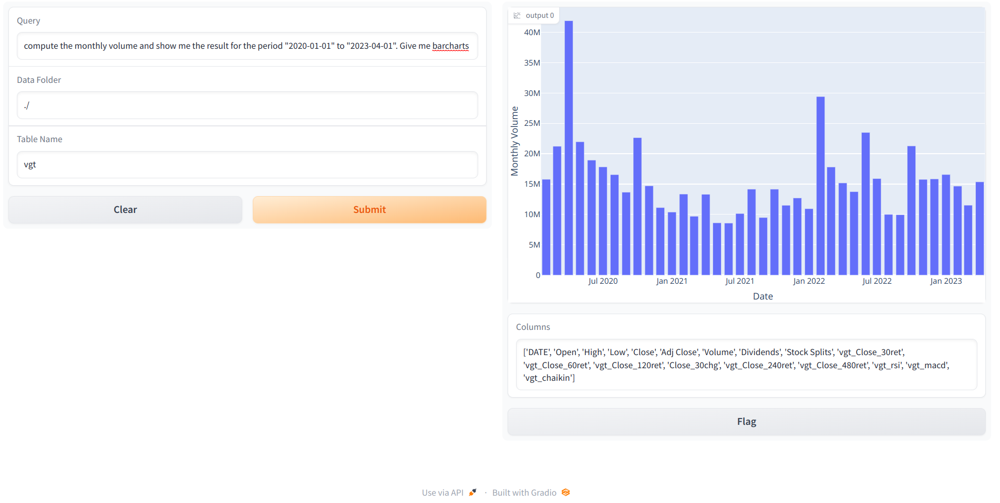

# QueryToGraph
QueryToGraph is a Python library that allows user to use simple English to create graph from a dataframe or csv file. It uses ChatGPT as the underlying engine. 

**For security's sake, it does not send the raw data to ChatGPT** but only the data schema (i.e. the data field names) is sent.


## Installation
You can install QueryToGraph using pip:

```bash
pip install querytograph
```

Sorry I have only tested this library in Linux.


## Usage

You need to have an paid OpenAI account and you need to set your OpenAI API Key in your environment variable. You can set it in the terminal:

```bash
export OPENAI_API_KEY="put your key here, don't copy this line as it is!"
```

Alternatively, you could do this from inside your Jupyter notebook or Python script:

```bash
import
os.environ["OPENAI_API_KEY"="put your key here, don't copy this line as it is!"
```

To use QueryToGraph, in your Jupyter notebook or Python script:

```Python
import querytograph
qtg = querytograph.QueryToGraph()
qtg.run_gr()
```

Go to your browser and use it, e.g.  http://127.0.0.1:7861



There are 3 textboxes which you have to key in  

1. Query  
   Question by the user, which will be used to generate the graph
2. Data Folder  
   Folder which contains Pandas dataframes in csv or pkl (pickle)
3. Table Name  
   Filename of the dataframe that the user wants to query on.
   Do not require the exact name


## Contributing
Contributions are welcome! Please contact me at franziss@gmail.com 
This was a hack over my weekend and I am sure there are bounds to have bugs... sorry.. =)

## License
This project is licensed under the MIT License - see the LICENSE file for details.

## Contact
franziss@gmail.com
